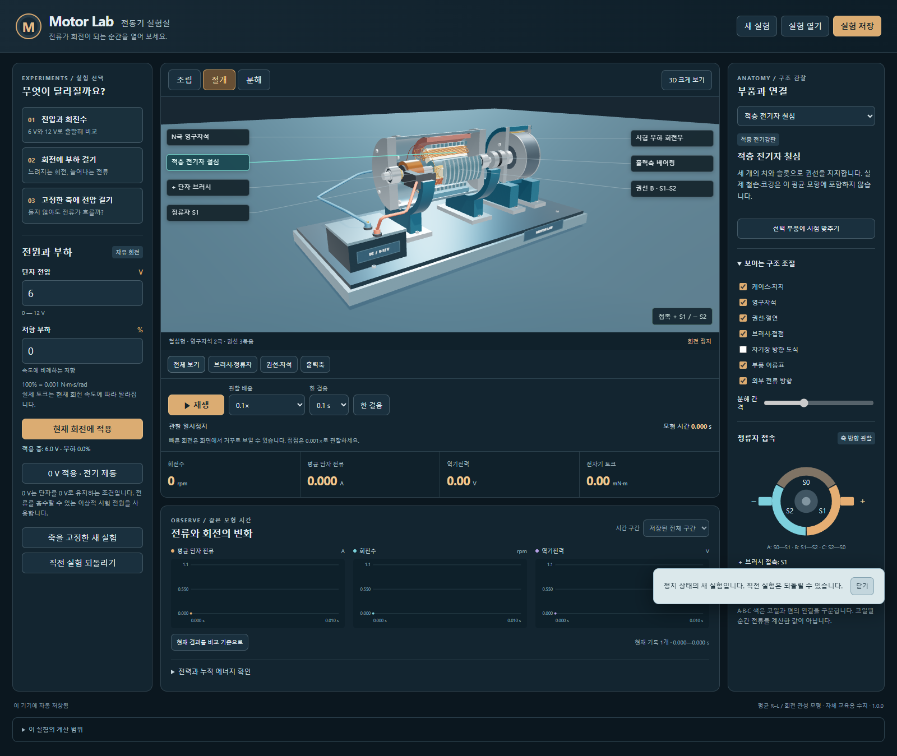
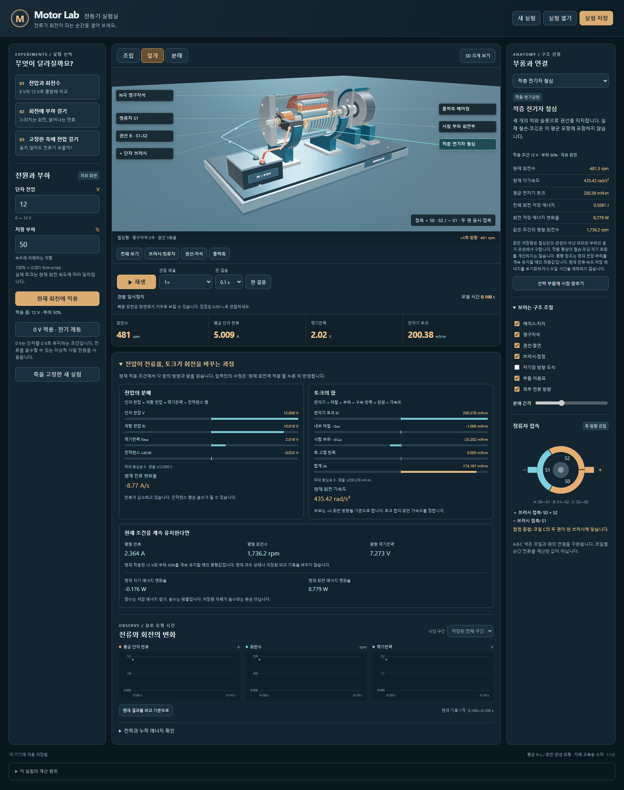
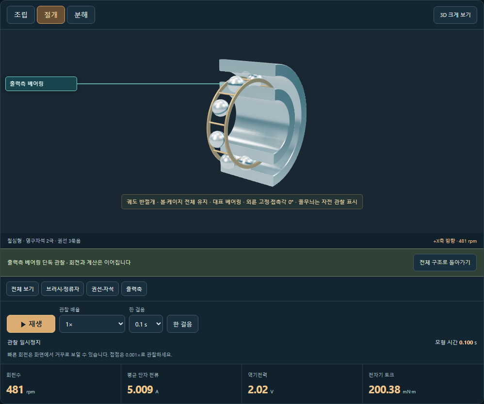
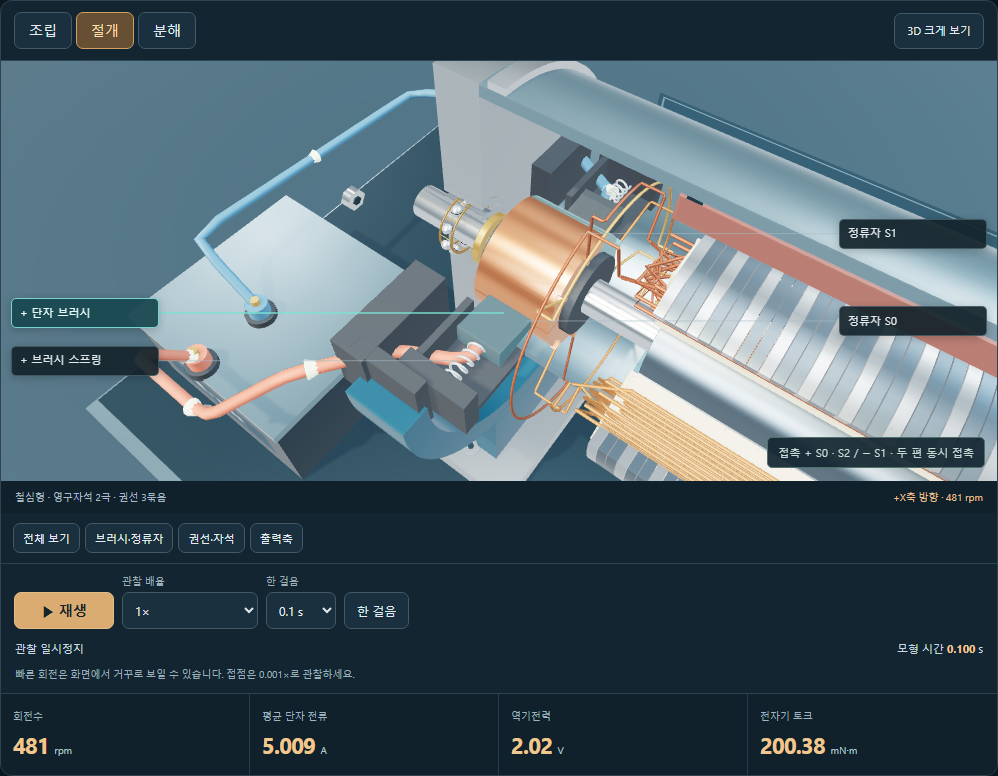

# Motor Lab

브러시 DC 모터의 구조와 전압·부하에 따른 전류·회전 응답을 관찰하는 한국어 Windows 앱입니다. **1.0은 구조 관찰과 세 가지 교육 실험을 범위로 합니다.** 실제 검사·설치·업데이트 결과는 각 릴리스의 검증 기록을 따릅니다. 외부 초보 사용자 연구나 실제 판매·유료 지원을 검증했다는 뜻은 아닙니다.

현재 브랜치는 **1.1.0 상세 개선 작업본**입니다. 공개된 설치판은 [1.0.0](https://github.com/Ulsancl/motor-lab/releases/tag/v1.0.0)이며 새 버전 게시 완료를 뜻하지 않습니다.

[공개 릴리스](https://github.com/Ulsancl/motor-lab/releases)에서 Windows 설치 파일과 SHA-256 확인 파일을 받습니다. 설치 후 바탕화면의 **Motor Lab** 아이콘으로 시작하세요. 배포별 설치·업데이트 검사 결과와 실행 환경은 릴리스 설명에 기록합니다.



32개 부품의 조립·절개·분해 화면에서 고정 브러시와 회전하는 정류자·권선의 연결을 살펴봅니다. 계측판과 그래프는 같은 평균 모형의 전류(A), 회전 속도(rpm), 역기전력(V), 토크(N·m)와 에너지를 보여줍니다. 그래프는 최대 1000개 표본 안에서 초기 응답·설정 변경·최신 상태를 우선 보관하며 중간 표본은 간소화할 수 있습니다. 모든 프레임을 기록하는 데이터 로거는 아니며, 선택한 비교 기록은 별도로 유지합니다.

관찰 재생 배율은 시간만 바꿉니다. 실제 모형의 회전각을 표시하므로 빠른 회전은 느리게 관찰하세요. 전압·부하를 바꾸면 현재 전류·속도·누적 에너지를 유지하고 이후 응답을 계산합니다. 고정축 실험은 정지한 새 상태에서 시작합니다. **0 V는 회로를 끄거나 개방하는 동작이 아니라 이상 전압원 단락 조건**입니다. 이때 회전 중 음의 전류로 제동할 수 있지만 공급 전력은 전압×전류이므로 0 W입니다. 양의 전압을 역기전력보다 낮게 설정하면 음의 전류와 공급 전력으로 에너지가 이상 전압원에 돌아갈 수 있습니다.

안내 실험은 6 V와 12 V의 각 3초 기동, 12 V 무부하 3초 후 부하 50%를 적용한 추가 3초, 고정축의 첫 10 ms를 실제로 계산한 뒤 멈춥니다. 다음 조건은 사용자가 버튼으로 시작합니다. 완료 카드에는 완료 시점의 결과를 고정해 보여 주며, 이후 자유 조작의 현재 값과 구분합니다. 안내 진행·완료 증거는 현재 세션에서만 유지되고 직전 실험 되돌리기에 함께 복원됩니다. 파일에는 물리 상태·그래프·비교·관찰 화면을 저장합니다.

## 1.1.0 상세 관찰



선택한 부품에서 현재 전류·회전·접촉 조건을 읽습니다. **전압의 분배**와 **토크의 합**은 저항·역기전력·인덕턴스, 전자기 토크·마찰·부하·축 고정 반력을 부호 그대로 보여 줍니다. 회생 중 음의 전류와 전력, 0 V 전기 제동, 축이 고정돼도 흐르는 전류를 구분합니다.

현재 적용 조건을 계속 유지할 때의 평형 전류·회전수와 현재 자기·회전 에너지 변화율을 함께 표시합니다. 평형값은 현재 과도 상태나 저장된 비교 기록을 바꾸지 않습니다. 소수 전압·부하를 가진 기존 실험 파일도 값 손실 없이 적용할 수 있습니다.

**3D 크게 보기**에서도 부품 선택과 계산값 확인이 가능합니다. 부품 선택은 시점을 유지하고, 가까이 보기로 바꾼 시점은 실험 파일에 저장됩니다. **베어링 단독 보기**는 축과 주변 구조를 잠시 숨겨 궤도·볼·보유기의 구름 운동을 볼 수 있게 합니다. **전체 구조로 돌아가기**를 누르면 원래 시점으로 돌아오며 저장 파일에는 원래 구조·시점을 보관합니다. 베어링의 궤도·볼·보유기와 브러시 안내벽을 보강했고, 구름 운동은 실제 계산에서 진행한 각도를 누적해 한 바퀴 경계에서도 이어집니다. 기존 파일에는 누적 회전수가 없어 불러올 때 베어링 표시 위상을 새 기준으로 시작합니다. [상세 관찰의 범위](docs/detail-refinement.md)를 참고하세요.





## 개발 실행

Node.js 24.19 계열에서 저장소 폴더의 터미널을 사용합니다.

```powershell
npm ci
npm run dev
```

`npm run test:detail`은 새 상세 계측·부품 확대·좁은 화면을 확인합니다. `npm test`는 계산·형상·저장·그래프·원자적 저장 검사를 실행합니다. `npm run build`는 웹 산출물, `npm run desktop`은 데스크톱 앱, `npm run package:desktop`은 Windows x64 NSIS 설치 파일과 SHA-256 파일을 만듭니다. 브라우저·네이티브 검사는 실제 화면을 사용하므로 동시에 실행하지 마세요. 네이티브 검사는 먼저 `node scripts/desktop.mjs prepare-test`로 번들을 준비한 뒤 `npm run test:desktop`을 실행합니다.

앱 런타임은 로컬 파일만 읽습니다. 개발 의존성 설치와 빌드 도구 준비에는 인터넷이 필요할 수 있습니다. 설치 파일은 코드 서명과 자동 업데이트를 제공하지 않습니다. 개발 소스·생성 결과의 권리 표기는 `UNLICENSED`이며, 외부 라이브러리의 별도 고지는 [제3자 고지](docs/THIRD-PARTY-NOTICES.md)를 따릅니다.

Windows 11 x64를 대상으로 개발했으며 실제 하드웨어 관찰은 NVIDIA GeForce RTX 5080·화면 배율 150% 환경에서 수행합니다. 다른 GPU·원격 데스크톱·다른 운영체제 전반의 호환성을 보장하지 않습니다. 설치 파일의 버전과 SHA-256은 받으려는 릴리스 설명에서 확인하세요. 기존 실험을 보관하고 앱을 닫은 뒤 새 설치 파일을 실행해 수동 업데이트합니다.

## 관찰과 데이터

- [실험 안내](docs/experiments.md): 기동, 부하, 고정축 비교와 단위.
- [모형](docs/model.md), [해부 구조](docs/anatomy.md), [원리 참고](docs/references.md).
- [저장과 복원](docs/storage.md), [설치 앱](docs/desktop.md), [개인정보](docs/privacy.md).
- [완성 기준과 한계](docs/release-scope.md), [문제 보고](docs/support.md).

평균 등가회로의 고정 상수를 사용하는 교육용 모형입니다. 권선별 순간 전류, PWM, 정류 아크, 코깅, 자속 포화, 유온·권선 온도와 실제 안전성을 계산하지 않습니다. 내부 권선 색은 연결 관계를 표시하며 실제 분기 전류를 뜻하지 않습니다. 분해 배치는 관찰용이고 계산은 조립 상태를 기준으로 합니다. 특정 제조사 제품의 설계도·성능 보증·수리 지침이 아닙니다.
